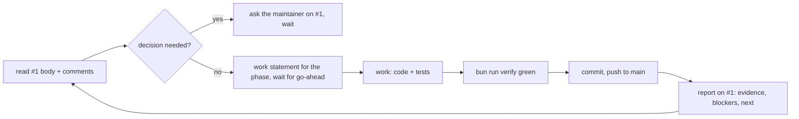

# CLAUDE.md

Guidance for AI agents working in this repository. What the project is and how to run it: `README.md`. The plan, phases, decisions and phase reports: issue #1 in the source repository.

**0bin-cloudflare** is a client-side encrypted pastebin on one Cloudflare Worker, a rewrite of 0bin (Python, dead upstream). The browser encrypts with WebCrypto AES-GCM and keeps the key in the URL `#fragment`; the Worker only ever stores ciphertext. Read #1's body before building anything.

## How work is coordinated



- **Issue #1 is the communication channel.** Plans, phase reports, evidence, blockers and questions go there as comments. Keep #1's body a clean statement of the current plan, not a history.
- **State the work before each phase and wait for the maintainer's go-ahead.** Within an approved phase, take initiative.
- Tick a checklist item only when a live run proves it, never by reading code.
- **Commits** are lower-case Conventional Commits, `type(scope): plain sentence` (commitlint enforces it in CI). **No Claude or AI attribution anywhere**: no Co-Authored-By trailers, no "generated with" lines in commits, PRs, issues or docs.

## Rules

- **Bun only.** `bun` and `bunx`, never npm or npx.
- **Never `wrangler deploy` or `wrangler dev --remote` by hand.** Forgejo Actions deploys on push to `main` (`.forgejo/workflows/deploy.yml`). Never point wrangler at the live account from a workstation.
- **Migrations** go in `migrations/` (edit `src/worker/db/schema` → `bun run db:generate` → commit the SQL). They run from `bun run deploy` (`db:migrate:remote`) in the deploy workflow; locally use `bun run db:migrate:local`.
- **`bun run verify` must pass before any commit.** CI runs the same checks plus commitlint.
- **No em dashes** in code, comments, docs or issues. Use hyphens or colons.
- **No dead code**: no commented-out blocks, unused exports or placeholder stubs left behind.
- **Mermaid diagrams are validated before committing**: `bunx -y @mermaid-js/mermaid-cli -i diagram.mmd -o diagram.svg` must exit 0.
- The server never sees a key or plaintext. Anything that would log, store or transmit the `#fragment` is a bug.
- Secrets are never in `wrangler.jsonc`, the repo or issues. `.dev.vars` is git-ignored.

## Stack and layout

- Bun, TypeScript, Vite + `@cloudflare/vite-plugin`, TanStack Start (React 19) + Tailwind v4, Hono on `/api/*`, Zod, D1 + Drizzle, Biome, Vitest.
- `src/server.ts` is the Worker entry: Hono owns `/api/*`, every other path is rendered by TanStack Start. `src/client`, `src/worker`, `src/shared`, `migrations`, `tests/{unit,integration,ssr}`.
- D1 gotchas: no interactive transactions (use `db.batch`), 100 bound params per statement.

## Checks before pushing

```sh
bun run verify   # biome ci . && bun run check && bun run test
```

`compatibility_date` must not be newer than the workerd bundled with `@cloudflare/vitest-pool-workers`, or the tests refuse to start.
