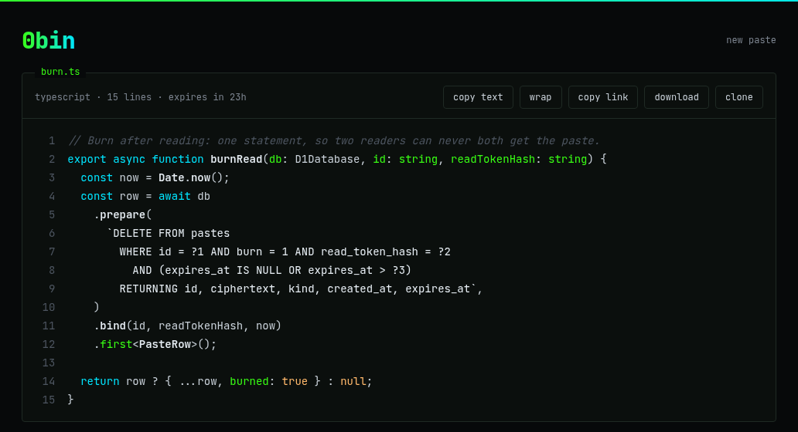
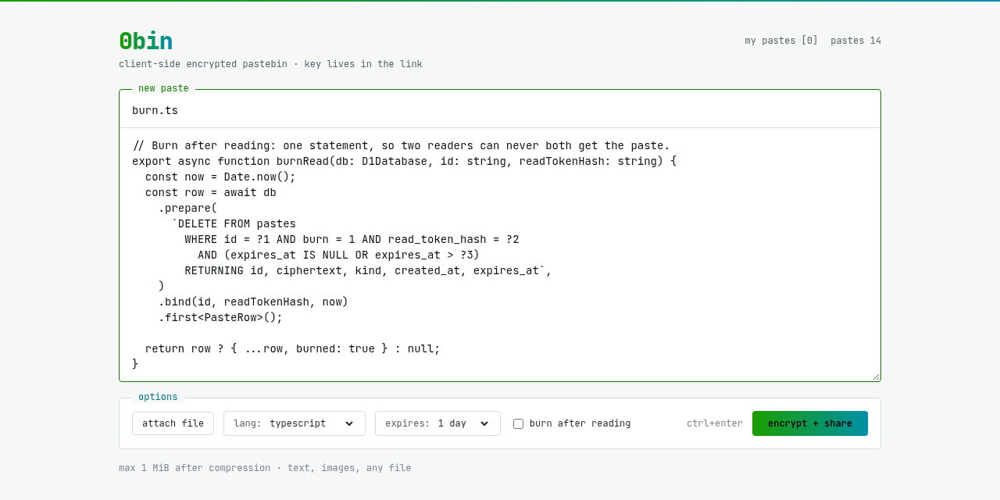
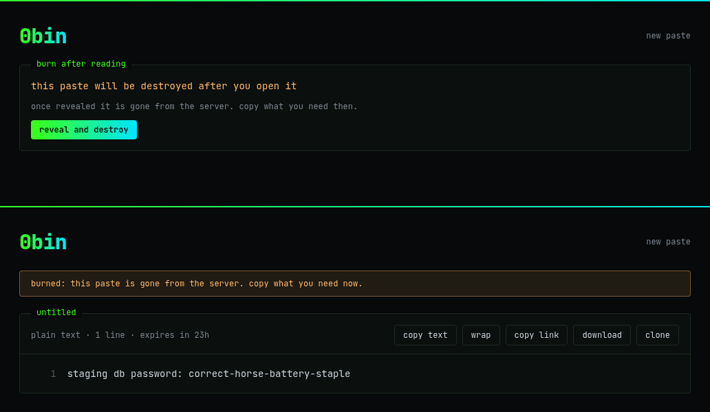
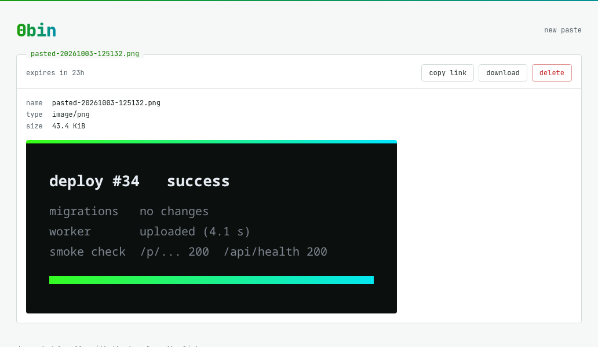
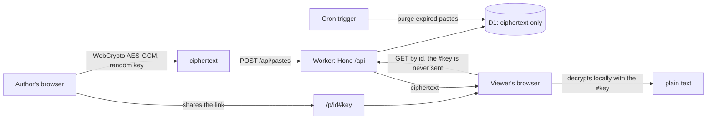

<div align="center">


# 0bin-cloudflare

**A client-side encrypted pastebin on one Cloudflare Worker.**<br>
Your browser encrypts the paste. The key lives in the link. The server only ever sees ciphertext.

[](https://paste.h1n054ur.dev)
[](https://github.com/h1n054ur/0bin-cloudflare/releases)
[](LICENSE)
[](https://workers.cloudflare.com)

[**Try it**](https://paste.h1n054ur.dev) · [How it works](#how-it-works) · [Self-host](#self-host) · [Design spec](docs/spec.md)

<br>



</div>

## Why

Pastebins see everything you paste. This one can't. A random key is made in your browser, the paste is encrypted with it before it leaves, and the key travels only in the part of the link after `#`, which browsers never send to a server. What lands in the database is noise.

It is a modern rewrite of [0bin](https://github.com/Tygs/0bin) (Python, no longer maintained), itself a take on sebsauvage's [ZeroBin](https://github.com/sebsauvage/ZeroBin): same idea, rebuilt as a single Worker with real burn-after-reading, file support and a strict CSP.

## Features

| | |
|---|---|
| **End-to-end encrypted** | WebCrypto AES-256-GCM in the browser, key only in the URL fragment, nothing readable on the server |
| **Burn after reading** | The paste is deleted by the one read that opens it: a single atomic `DELETE ... RETURNING`, so two readers can never both get it |
| **Expiry** | 1 hour, 1 day, 1 week, 1 month or never; expired pastes vanish at once and are purged hourly |
| **Code that looks good** | Syntax highlighting for about 30 languages, picked or auto-detected (prose stays plain), line numbers, wrap |
| **Files and images** | Any file type; drop it on the page or paste a screenshot straight from the clipboard; images preview inline |
| **Your pastes, your control** | Your browser keeps an owner token: reopen your own burn paste without burning it, delete any of your pastes |
| **Admin page** | Stats, list, delete by link or id, purge expired now |
| **Bot check** | Cloudflare Turnstile on create, invisible and opt-in: on only when the secret is set |
| **Locked down** | Per-request CSP nonce on every script, `no-referrer`, HSTS, rate-limited create, three create modes |
| **Light and dark** | A terminal look in both, following your system theme |

## Screenshots

<table>
  <tr>
    <td width="50%"><br><sub>Write or paste, pick a language and an expiry, encrypt and share.</sub></td>
    <td width="50%"><br><sub>Burn after reading: a warning first, then one read and it is gone.</sub></td>
  </tr>
  <tr>
    <td width="50%"><br><sub>Paste a screenshot from the clipboard; it is encrypted like text.</sub></td>
    <td width="50%"><br><sub>Highlighted, numbered, decrypted locally.</sub></td>
  </tr>
</table>

## How it works



- **One secret per paste.** 32 random bytes live only in the URL `#fragment`. HKDF turns them into the AES-256-GCM key and a separate read token; the server stores only the read token's hash, so knowing an id is not enough to fetch or burn a paste.
- **Compressed, then encrypted.** Text and files are deflated in the browser before encryption, so the 1 MiB limit goes a long way.
- **D1, not KV.** KV is eventually consistent, so a burn paste could be read twice. D1 deletes and returns the row in one statement.

| The server sees | The server never sees |
|---|---|
| a random id, the ciphertext and its size, text or file, burn flag, timestamps, token hashes | the key, the plain text, the title, the file name or type, the language |

The full design, including the 0bin feature inventory and every API route, is in [`docs/spec.md`](docs/spec.md).

## Self-host

You need a Cloudflare account and [Bun](https://bun.sh).

```sh
git clone https://github.com/h1n054ur/0bin-cloudflare && cd 0bin-cloudflare
bun install
export CLOUDFLARE_ACCOUNT_ID=<your account id>
bunx wrangler d1 create 0bin-cloudflare-db     # put the database_id it prints in wrangler.jsonc
# in wrangler.jsonc: set your own custom domain route (or remove it) and pick CREATE_MODE
bunx wrangler secret put ADMIN_TOKEN           # enables /admin
bunx wrangler secret put CREATE_TOKEN          # only for CREATE_MODE=token
bun run deploy                                 # D1 migrations, build, wrangler deploy
```

### Create modes

`CREATE_MODE` decides who may create pastes. Viewing always needs only the link.

| Mode | Who can create |
|---|---|
| `off` | nobody: create answers 404 |
| `open` | anyone, 10 per minute per IP (the live instance runs this) |
| `token` | whoever has the team key (`CREATE_TOKEN`), entered once on the create page and kept in that browser |

The admin API and page need `Authorization: Bearer <ADMIN_TOKEN>`; without the secret they do not exist. Running `open` on the public internet means content you cannot moderate (it is all encrypted), so prefer `token` unless you keep an eye on it.

**Turnstile.** A bot check on create, on top of the per-IP limit. Put the widget's public site key in the `TURNSTILE_SITE_KEY` var in `wrangler.jsonc` (`""` means off) and set its secret with `bunx wrangler secret put TURNSTILE_SECRET_KEY`. With the secret set, every create must carry a valid token (403 otherwise); without it, create works as before. Only the create page's CSP allows `challenges.cloudflare.com`.

## Develop

```sh
bun install
bun run db:migrate:local
bun run dev            # http://localhost:5173
bun run verify         # biome, typecheck, unit + integration (workerd) + SSR tests
```

Every push to `main` on the source repo is checked (commit lint, leak check, lint, typecheck, about 200 tests) and deployed by Forgejo Actions, ending with a live smoke check. The GitHub repository is a read-only mirror of that source repo.

### Built with

[Cloudflare Workers](https://workers.cloudflare.com) and [D1](https://developers.cloudflare.com/d1/) · [Hono](https://hono.dev) · [TanStack Start](https://tanstack.com/start) with React 19 · [Tailwind CSS v4](https://tailwindcss.com) · [Drizzle](https://orm.drizzle.team) · [Zod](https://zod.dev) · [highlight.js](https://highlightjs.org) · [Vitest](https://vitest.dev) · [Biome](https://biomejs.dev) · [Bun](https://bun.sh)

```
src/server.ts   Worker entry: security headers, Hono on /api/*, TanStack Start for pages, cron purge
src/client      React routes and components: create, view, admin
src/worker      Hono routes, create and admin gates, rate limit, D1 schema, purge
src/shared      browser crypto and the Zod API contract, used by both sides
migrations      D1 migrations, applied by bun run deploy
tests           unit (Node), integration (workerd) and SSR tests
```

## Credits

The idea and the original code: [ZeroBin](https://github.com/sebsauvage/ZeroBin) by sebsauvage and [0bin](https://github.com/Tygs/0bin) by Sam & Max. This is an independent rewrite; no code is shared.

## License

[MIT](LICENSE)
