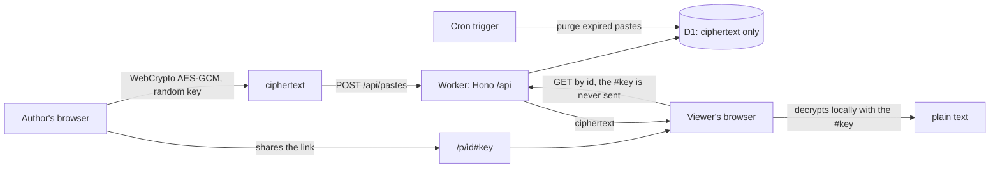

# 0bin-cloudflare

A client-side encrypted pastebin on one Cloudflare Worker. Text and files are encrypted in your browser before they leave, and the key never reaches the server, so the server stores only ciphertext it cannot read. It is a rewrite of [0bin](https://github.com/Tygs/0bin) (Python, no longer maintained), which itself followed sebsauvage's [ZeroBin](https://github.com/sebsauvage/ZeroBin), the original idea. Live at https://paste.h1n054ur.dev.

## Features

- Text with syntax highlighting (about 30 languages, auto-detected or picked), files of any type, images previewed inline. Paste an image straight from the clipboard or drop a file on the page.
- Expiry: 1 hour, 1 day, 1 week, 1 month or never. Burn after reading: the paste is deleted by the one read that opens it.
- The creator's browser keeps a "my pastes" list with an owner token, so the creator can reopen a burn paste without burning it and delete any of their pastes.
- Admin page (`/admin`): stats, list, delete by link or id, purge expired now.
- Creating can be closed, open, or behind a shared team key (see [Create modes](#create-modes)).
- Rate limit on create (10 per minute per user or IP), strict CSP with a per-request nonce, `Referrer-Policy: no-referrer`.

## How it works



- **Encryption in the browser.** A random 32-byte secret per paste lives only in the URL `#fragment`, which browsers never send. HKDF derives the AES-256-GCM key and a separate read token from it; the server stores only the read token's hash, so the id alone cannot fetch or burn a paste.
- **D1, not KV.** Burn after reading is one atomic `DELETE ... RETURNING`, so a paste can be read once and only once, even under concurrent requests.
- **Expiry.** Expired pastes are hidden immediately and purged hourly by a cron trigger.

The full design is in [`docs/spec.md`](docs/spec.md).

## Create modes

`CREATE_MODE` in `wrangler.jsonc` decides who may create pastes (and read `/api/stats`). Viewing a paste always needs only its link.

| Mode | Who can create | Admin (`/api/admin/*`) |
|---|---|---|
| `off` | nobody (create answers 404) | `ADMIN_TOKEN` bearer, or off when unset |
| `open` | anyone, rate limited per IP | `ADMIN_TOKEN` bearer, or off when unset |
| `token` | whoever has the team key: the `CREATE_TOKEN` secret, entered once on the create page and kept in that browser | `ADMIN_TOKEN` bearer, or off when unset |

Secrets are set with `bunx wrangler secret put <NAME>`: `CREATE_TOKEN` for `token`, `ADMIN_TOKEN` to enable the admin page.

Running `open` on the public internet invites abuse you cannot moderate: everything is encrypted. Prefer `token` unless you watch it.

## Develop

Needs [Bun](https://bun.sh).

```sh
bun install
bun run db:migrate:local
bun run dev            # http://localhost:5173
```

## Check

```sh
bun run verify         # biome ci, typecheck, unit + integration (workerd) + SSR tests
```

## Deploy

This instance deploys from Forgejo Actions on every push to `main` (`.forgejo/workflows/deploy.yml`): `bun run deploy` applies D1 migrations, builds and runs `wrangler deploy`, then a smoke check hits a view page and `/api/health`. CI (`.forgejo/workflows/ci.yml`) lints commit messages, runs a leak check, lints, typechecks and tests every push and pull request.

To run your own copy on your Cloudflare account:

```sh
export CLOUDFLARE_ACCOUNT_ID=<your account id>
bunx wrangler d1 create 0bin-cloudflare-db     # put the database_id it prints in wrangler.jsonc
# in wrangler.jsonc: change or remove the custom domain route, pick CREATE_MODE
bunx wrangler secret put CREATE_TOKEN          # for CREATE_MODE=token
bunx wrangler secret put ADMIN_TOKEN           # to enable /admin
bun run deploy                                 # migrations, build, wrangler deploy
```

## Layout

```
src/server.ts   Worker entry: security headers, Hono on /api/*, TanStack Start renders every other path, cron
src/client      React 19 routes and components: create, view, admin
src/worker      Hono routes, gates (create modes, admin), rate limit, D1 schema (Drizzle), purge
src/shared      browser crypto and the Zod API contract, used by both sides
migrations      D1 migrations, applied by bun run deploy
tests           unit (Node), integration (workerd) and SSR tests
```

## Licence

[MIT](LICENSE).
