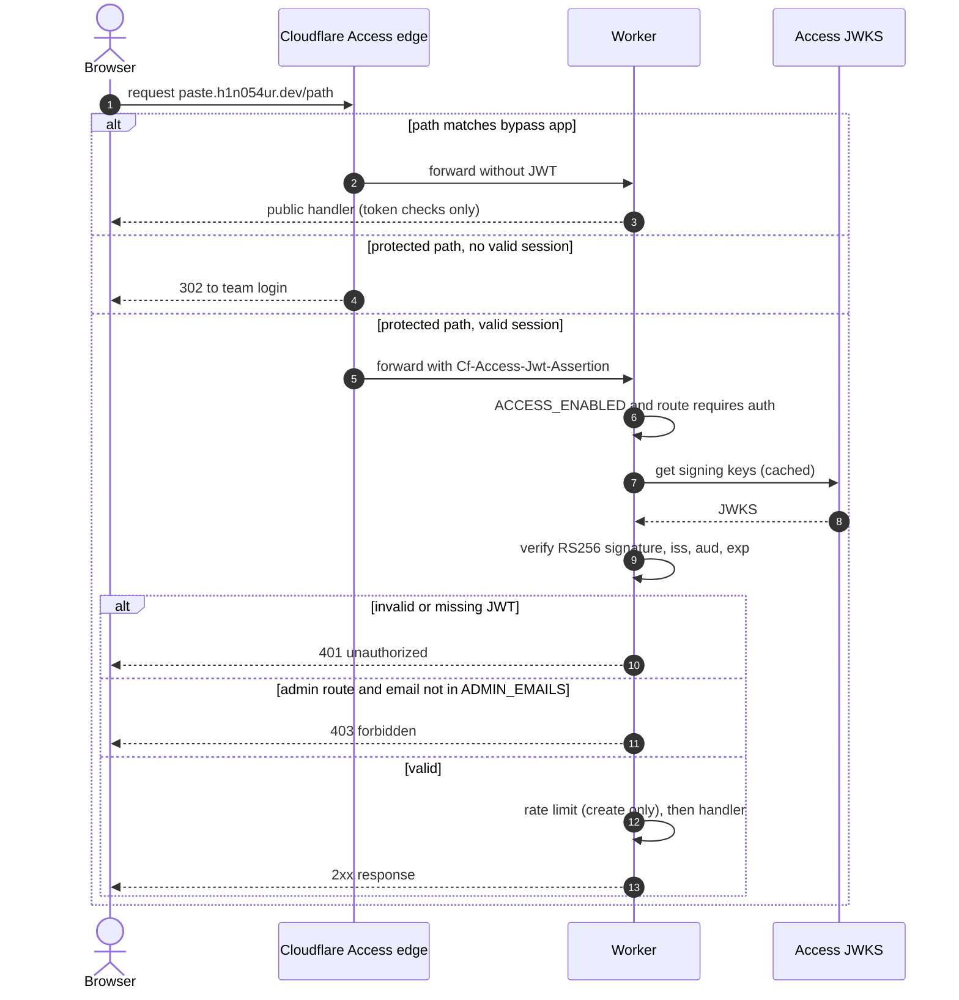
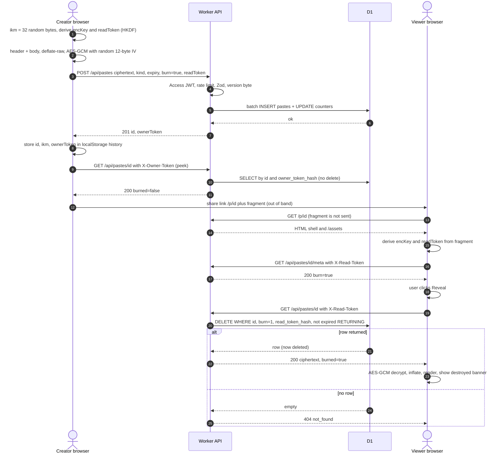

# 0bin-cloudflare: design spec

Client-side encrypted pastebin. A rewrite of [0bin](https://github.com/Tygs/0bin) (Python/Bottle, unmaintained) as one Cloudflare Worker.
Host: `paste.h1n054ur.dev`. License: MIT. Inventory taken from 0bin `master` (shallow clone, 2026-10-03).

Fixed decisions (not reopened here): Worker; Hono on `/api/*`; TanStack Start (React 19) + Tailwind v4 for pages; Zod; D1 + Drizzle; cron purge; WebCrypto AES-GCM (no SJCL, no old-link compatibility); key only in the URL `#fragment`; create + admin behind Cloudflare Access, view needs only the link; Worker verifies `Cf-Access-Jwt-Assertion` on create and admin; Workers rate-limit binding (namespace `5001`) on create; Access gate optional via config for self-hosters.

---

> **Since 0.2.0 Cloudflare Access is removed.** Create modes are `off`, `open` and `token`, and admin uses `ADMIN_TOKEN` only; the Access parts below (5.7 auth, 7.3, 7.4 `ACCESS_*`/`ADMIN_EMAILS`, the Access sequence diagram) are kept as design history.

## 1. 0bin feature inventory

Decision: **K** = Keep, **C** = Change, **D** = Drop.

| # | Feature / behaviour | 0bin source | What 0bin does | Dec | Reason |
|---|---|---|---|---|---|
| 1 | Client encryption | `behavior.js` `zerobin.encrypt/decrypt` | `sjcl.encrypt(key, base64(utf8(text)))`: key used as a password (PBKDF2-SHA256, 1000 iter), AES-256-CCM, 64-bit tag, JSON `{iv,salt,ct,...}` | C | WebCrypto AES-256-GCM with a raw 256-bit key; no PBKDF2 needed for a random key |
| 2 | Key generation | `behavior.js` `makeKey` | 256 random bits (SJCL collectors), base64, `=` stripped, only the first `/` replaced by `-` (regex lacks `g`) | C | `crypto.getRandomValues`, 32 bytes, base64url |
| 3 | Key in URL fragment | `encryptAndSendPaste`, `getPasteKey` | Redirects to `/paste/<id>#<key>`; fragment never sent to server | K | Core property; path becomes `/p/<id>` |
| 4 | Compression | `zerobin.encrypt` | Progress bar says "Compressing..." but nothing is compressed (`lzw` global unused); text is base64'd before encryption (+33%) | C | Real `deflate-raw` via `CompressionStream`, no inner base64 |
| 5 | Paste id | `paste.py` `Paste.__init__`, `PASTE_ID_LENGTH` | First 8 chars (4-27 configurable) of `base64(sha1(ciphertext))`, `/`->`-`, `+` kept | C | 12-char random base64url; not derived from content |
| 6 | Id collision | `Paste.save` | Same prefix silently overwrites the existing file | C | `INSERT` fails on PK, server retries with a new id |
| 7 | Storage | `Paste.save`, `get_path` | Flat file `pastes/xx/yy/<id>`: line 1 expiration, line 2 content, line 3 metadata JSON | C | D1 rows |
| 8 | Expiry options | `home.tpl`, `Paste.DURATIONS` | `burn_after_reading`, `1_day` (86400 s), `1_month` (30 d), `never` (100 years); UI default `1_day`, server default `burn_after_reading` | C | `1h/1d/1w/1m/never` + separate burn flag; `never` = NULL (section 5) |
| 9 | Expired pastes | `routes.display_paste`, `cli.clean_expired_pastes` | Deleted lazily when read; manual CLI cleanup | C | Read query filters expired rows + hourly cron purge |
| 10 | Burn after reading | `routes.display_paste` | Rendering the HTML page deletes the file and still returns the content; `load` then `os.remove` is not atomic, so concurrent readers can both read | C | One atomic `DELETE ... RETURNING` |
| 11 | Burn grace for creator | `Paste.save`, `display_paste` | Expiration stored as `burn_after_reading#<local time>`; any read within 10 s of creation is not burned ("will be deleted the next time") | C | Time window lets anyone (or a bot) read twice; replaced by owner-token peek (5.3) |
| 12 | Unread burn pastes | `Paste.has_expired` | Never expire; CLI cleanup skips them | C | Burn requires an expiry, cron purges them |
| 13 | Owner key | `Paste.owner_key` | `sha256(SECRET_KEY + id)` hex, stateless; rotating `SECRET_KEY` invalidates all | C | Random 32-byte token; only its SHA-256 stored |
| 14 | Owner delete | `routes.delete_paste`, `handleDeletePaste` | `DELETE /paste/:id`, form field `owner_key`, compared with `!=`, 403 on mismatch | K | Same feature as `DELETE /api/pastes/:id` + header |
| 15 | Owner key on client | `zerobin.storePaste` | Stores URL with `?owner_key=` query plus a separate `...#owner_key` localStorage item | C | One versioned JSON list (6.4) |
| 16 | Previous pastes menu | `getPreviousPastes`, `base.tpl` | localStorage keys `zerobinV0.1.1#<date>` -> full URL incl. key; cap intended 20 but checks total `localStorage.length` | C | Versioned list, cap 50, forget / clear actions |
| 17 | Drop dead entries | `window.onload` (404 branch) | On 404 removes the paste from local history | K | Same on 404 |
| 18 | Max size | `default_settings.MAX_SIZE`, `create_paste`, `zerobin.count` | 1,024,000 chars of encrypted content; client estimates bytes of the form JSON; Bottle `MEMFILE_MAX = MAX_SIZE + 100 KB` | C | Exact byte limit on the ciphertext blob (7.1) |
| 19 | Payload sanity check | `create_paste` | Rejects content lacking the substring `{"iv":` | C | Zod schema + version byte check |
| 20 | Text paste form | `home.tpl`, `behavior.js` | Textarea, Ctrl+Enter submits, auto-grow, second toolbar when tall | K | Same UX (toolbar detail is UI freedom) |
| 21 | Non-image file upload | `zerobin.upload` | `FileReader.readAsText` into the textarea: binary files corrupt, name and MIME lost | C | Read as bytes, any type; name + MIME encrypted |
| 22 | Image upload | `zerobin.upload`, `compressImage` | Data URL, re-encoded via canvas to JPEG q0.7 (lossy, drops transparency), data URL encrypted as text | C | Raw original bytes, inline preview |
| 23 | Drag-drop / paste image | `handleDrop`, `handlePaste` | Drop file on textarea; pasting a clipboard image uploads it | K | Same |
| 24 | Syntax highlighting | decrypt callback, `isCode`, `prettify.min.js` | Google Prettify, only if heuristic `isCode` > 100; "force coloration" button; line numbers | C | highlight.js; creator picks language or Auto (8.5) |
| 25 | Copy to clipboard | `copyToClipboard` | `navigator.clipboard.writeText`, text pastes only | K | Same |
| 26 | Download | `currentPaste.downloadLink` | Text as `data:text/html` named `0bin_<id>.txt` (wrong MIME), image as data URL | C | Blob URL with original name and MIME |
| 27 | Clone | `handleClone`, `paste.tpl` clone form | Hidden second form prefilled with content and title | K | Prefill create page via `sessionStorage` |
| 28 | Email this | `handleSendByEmail` | `mailto:` with the full URL including the key | D | Pushes the key into mail systems; "Copy link" + Web Share covers it |
| 29 | Reader mode | `toggleReaderMode`, `increaseFontSize` | `?readerMode=1`, font size +/- | D | Niche; a wrap toggle covers readability |
| 30 | QR code | not present | No QR code in current source (older releases only) | D | Absent upstream; not planned |
| 31 | Title | `Paste.__init__`, `base.tpl` | Unencrypted, bleach-cleaned, 60 chars, rendered as `<h1>`, indexable | C | Moved inside the encrypted header |
| 32 | BTC tip address, "buy bitcoin" page | `paste.tpl`, `buy_bitcoin.tpl` | Unencrypted tip address per paste, default address, affiliate link | D | Out of scope |
| 33 | Paste counter | `Paste.increment_counter`, `get_pastes_count` | File counter with lockfile; global cache refreshed every 60 s (`REFRESH_COUNTER`); footer | K | D1 `counters` row incremented in the create batch |
| 34 | Admin | `routes.admin/login/logout`, `utils.ensure_app_context` | URL `/admin/<sha256("admin"+SECRET_KEY)>/`, scrypt password, 300 s file session; delete one paste by URL or id; no listing | C | Access-gated `/admin` with list, stats, delete, purge |
| 35 | 404 / expired page | `routes.error404`, `404.tpl` | Same page for missing, expired, burned; includes a new-paste form | K | Same single message; no form (create is gated) |
| 36 | Footer menu, FAQ, mailto obfuscation | `MENU`, `faq.tpl`, `base.tpl` | Configurable links, FAQ page, JS email unscrambling | D | README covers it |
| 37 | Settings file + custom views dir | `utils.ensure_app_context` | `settings.py`, `custom_views/` override templates | D | Config via wrangler vars (7.4) |
| 38 | `<noscript>` notice | `base.tpl` | Explains JS is required | K | Same |
| 39 | Static file route | `routes.server_static` | Bottle serves `/static/*` | C | Workers static assets `/assets/*` |
| 40 | Staged progress bar | `zerobin.encrypt/decrypt` | `setTimeout` chain with progress labels | D | WebCrypto is async and fast; a single busy state |

**Counts: Keep 10, Change 23, Drop 7 (40 rows).**

---

## 2. Architecture

```
Browser (React page) ──fetch──> Worker
                                 ├─ /api/*      -> Hono app (Zod, Drizzle -> D1 binding DB)
                                 ├─ /assets/*   -> static assets
                                 ├─ everything else -> TanStack Start SSR
                                 └─ scheduled() -> purge expired rows
```

- D1 database `0bin-cloudflare-db`, binding `DB`. Rate limiter binding `CREATE_LIMITER`.
- Shared modules used by both Worker and browser: `crypto` (WebCrypto only, no Node APIs), Zod `schemas`.
- The view page must not depend on TanStack server functions (`/_serverFn/*`); it talks only to `/api/pastes/*` so the Access bypass list stays short.

---

## 3. D1 schema

Timestamps are integer milliseconds since epoch (UTC).

```sql
-- migrations/0002_pastes.sql (0001_init, the Phase 0 placeholder `meta` table, is already applied live)
DROP TABLE meta;
CREATE TABLE pastes (
  id               TEXT    PRIMARY KEY NOT NULL CHECK (length(id) = 12),
  ciphertext       TEXT    NOT NULL,                 -- base64url of the blob (section 4)
  size             INTEGER NOT NULL,                 -- decoded blob length in bytes
  kind             TEXT    NOT NULL CHECK (kind IN ('text', 'file')),
  burn             INTEGER NOT NULL DEFAULT 0 CHECK (burn IN (0, 1)),
  read_token_hash  TEXT    NOT NULL,                 -- hex SHA-256 of read token
  owner_token_hash TEXT    NOT NULL,                 -- hex SHA-256 of owner token
  created_at       INTEGER NOT NULL,
  expires_at       INTEGER                           -- NULL = never
);

CREATE INDEX pastes_expires_at_idx ON pastes (expires_at) WHERE expires_at IS NOT NULL;
CREATE INDEX pastes_created_at_idx ON pastes (created_at, id);

CREATE TABLE counters (
  name  TEXT    PRIMARY KEY NOT NULL,
  value INTEGER NOT NULL DEFAULT 0
);
INSERT INTO counters (name, value) VALUES ('pastes_created', 0);
```

```ts
// src/worker/db/schema.ts
import { sql } from "drizzle-orm";
import { index, integer, sqliteTable, text } from "drizzle-orm/sqlite-core";

export const pastes = sqliteTable(
  "pastes",
  {
    id: text("id").primaryKey(),
    ciphertext: text("ciphertext").notNull(),
    size: integer("size").notNull(),
    kind: text("kind", { enum: ["text", "file"] }).notNull(),
    burn: integer("burn", { mode: "boolean" }).notNull().default(false),
    readTokenHash: text("read_token_hash").notNull(),
    ownerTokenHash: text("owner_token_hash").notNull(),
    createdAt: integer("created_at").notNull(),
    expiresAt: integer("expires_at"),
  },
  (t) => [
    index("pastes_expires_at_idx").on(t.expiresAt).where(sql`${t.expiresAt} IS NOT NULL`),
    index("pastes_created_at_idx").on(t.createdAt, t.id),
  ],
);

export const counters = sqliteTable("counters", {
  name: text("name").primaryKey(),
  value: integer("value").notNull().default(0),
});
```

Notes:
- Ciphertext is stored as base64url TEXT, not BLOB: the API carries base64url anyway (no re-encoding in the Worker) and it avoids D1 BLOB marshalling (D1 has returned BLOB columns as number arrays). Cost: 4/3 size, budgeted in 7.1.
- IV is not a separate column: it is the bytes 1..12 of the blob. The server never parses it.
- `CHECK` constraints are in the SQL migration; Drizzle does not need to model them. Run `drizzle-kit generate` (it emits the `meta` drop because the table leaves the Drizzle schema), then hand-add the `CHECK`s and the counter seed.
- Raw owner and read tokens never touch D1 or logs.

---

## 4. Crypto format

| Item | Value |
|---|---|
| Link secret `ikm` | 32 random bytes, base64url no padding = **43 chars**, only in `#fragment` |
| Encryption key | `HKDF-SHA256(ikm, salt = empty, info = "0bin-cf/v1/enc")` -> AES-256-GCM `CryptoKey`, non-extractable |
| Read token | `HKDF-SHA256(ikm, salt = empty, info = "0bin-cf/v1/read")`, 32 bytes, base64url |
| IV | 12 random bytes per encryption |
| Tag | 128 bits (WebCrypto default) |
| AAD | UTF-8 `"0bin-cf/v1|" + kind` (binds the server-visible `kind` to the ciphertext) |
| Owner token | 32 random bytes, base64url, generated by the **server** at create |

Packaging (client):

```
header   = UTF-8 JSON { v: 1, kind: "text"|"file", title?, lang?, name?, mime? }
plain    = u32be(byteLength(header)) || header || body      body = UTF-8 text or raw file bytes
packed   = deflate-raw(plain)                                CompressionStream("deflate-raw")
ct       = AES-GCM(encKey, iv, packed, aad)
blob     = 0x01 (format version) || iv (12) || ct (incl. 16-byte tag)
wire     = base64url(blob), no padding
```

- Header limits (client-enforced, checked again after decrypt): JSON <= 4 KiB, `title` <= 100 chars, `name` <= 255, `mime` <= 127, `lang` <= 32 (`"auto"` or a highlight.js language id). All rendered as text, never as HTML.
- Server sees only: id, blob length, `kind`, `burn`, timestamps, token hashes. Title, filename, MIME, language and content are inside the ciphertext. Length is visible (as in 0bin).
- **Compression is justified**: native API, no library, text shrinks 3-5x so the effective paste limit rises well above 1 MiB. No compression oracle risk: one author, one secret, no attacker-controlled data mixed in. Viewer inflates with a 16 MiB output cap (bomb guard).
- **Why the IV is safe to store**: GCM requires IV uniqueness per key, not secrecy. Every paste has a fresh random key and exactly one encryption under it, so IV reuse is impossible; the IV is public by design.
- **Why the read token**: the server can demand proof of key knowledge without learning the key (HKDF output with a different `info` is independent of the encryption key). Effects: someone holding only the id (admin list, logs, a truncated link) cannot fetch or burn a paste; a mistyped key cannot burn it either.
- URL format: `https://paste.h1n054ur.dev/p/<id>#<ikm>`. Browsers do not send fragments in requests or `Referer`; pages also send `Referrer-Policy: no-referrer`.
- Main threat is XSS stealing `location.hash`: strict CSP (`script-src 'self'` + nonce if Start emits inline scripts, `connect-src 'self'`, `frame-ancestors 'none'`, `base-uri 'none'`), no third-party scripts, no analytics or error reporters that capture URLs.
- No compatibility with 0bin SJCL links.

---

## 5. API (Hono, `/api/*`)

Common: JSON only; error body `{ error: string, message?: string, issues?: ZodIssue[] }`; paste routes send `Cache-Control: no-store` and `X-Robots-Tag: noindex`; no CORS headers (same origin only).

Shared Zod pieces:

```ts
const B64U = /^[A-Za-z0-9_-]+$/;
const Id = z.string().regex(/^[A-Za-z0-9_-]{12}$/);
const Token = z.string().regex(B64U).length(43);
const Expiry = z.enum(["1h", "1d", "1w", "1m", "never"]);
const Kind = z.enum(["text", "file"]);
```

### 5.1 `POST /api/pastes` (create; Access-gated)

```ts
const CreatePasteBody = z.object({
  ciphertext: z.string().regex(B64U).min(39).max(MAX_CIPHERTEXT_B64),   // 39 = 29-byte minimum blob
  kind: Kind,
  expiry: Expiry.default("1d"),
  burn: z.boolean().default(false),
  readToken: Token,
}).strict()
  .refine((b) => !(b.burn && b.expiry === "never"), { path: ["expiry"], message: "burn_requires_expiry" });

const CreatePasteResponse = z.object({
  id: Id, url: z.string(),            // "/p/<id>" (client appends "#<ikm>")
  ownerToken: Token,
  createdAt: z.number().int(), expiresAt: z.number().int().nullable(), burn: z.boolean(),
});
```

Order: body size cap (Hono `bodyLimit`, 1,500,000 bytes) -> Access JWT (if enabled) -> rate limit -> Zod -> decode first 4 chars, byte 0 must be `0x01`, `ciphertext.length % 4 !== 1` -> generate id + owner token -> `db.batch([INSERT pastes, UPDATE counters SET value = value + 1 WHERE name = 'pastes_created'])` (atomic). On PK conflict retry id up to 3 times.

| Status | When |
|---|---|
| 201 | Created, body `CreatePasteResponse` |
| 400 `invalid_request` | Zod failure, bad version byte, burn + never |
| 401 `unauthorized` | Access enabled and JWT missing/invalid |
| 413 `payload_too_large` | Body > 1,500,000 bytes or ciphertext > limit |
| 415 `unsupported_media_type` | Not `application/json` |
| 429 `rate_limited` | Limiter refused; `Retry-After: 60` |
| 500 `internal` | D1 failure |

The owner token appears **only** in this response. The client stores it in the local history list (6.4).

### 5.2 `GET /api/pastes/:id/meta` (public)

Header `X-Read-Token` (required). Non-destructive. Lets the view page warn before burning.
200 `{ id, kind, size, burn, createdAt, expiresAt }`. 404 `not_found` for: bad id format, unknown, expired, token mismatch (indistinguishable on purpose).

### 5.3 `GET /api/pastes/:id` (public, burn semantics)

Headers: `X-Read-Token` (viewer) **or** `X-Owner-Token` (creator peek).
200 `{ id, ciphertext, kind, burn, createdAt, expiresAt, burned: boolean }`; `burned: true` means the row is gone and this response is the only copy. 404 `not_found` otherwise (same cases as meta).

Queries (`now` = request time):

1. Owner peek (if `X-Owner-Token`): `SELECT ... WHERE id = ?1 AND owner_token_hash = ?2 AND (expires_at IS NULL OR expires_at > ?3)`. Never deletes; `burned: false`.
2. Burn read: `DELETE FROM pastes WHERE id = ?1 AND burn = 1 AND read_token_hash = ?2 AND (expires_at IS NULL OR expires_at > ?3) RETURNING *`. Row -> 200 `burned: true`. A single SQLite statement, so two concurrent readers can never both get a row.
3. Normal read (if step 2 returned nothing): `SELECT ... WHERE id = ?1 AND burn = 0 AND read_token_hash = ?2 AND (expires_at IS NULL OR expires_at > ?3)`.
4. Nothing -> 404.

Token hashes are compared inside SQL (equality on SHA-256 hex), so no timing oracle on the raw token.

### 5.4 `DELETE /api/pastes/:id` (public, owner)

Header `X-Owner-Token` (required, `Token`). `DELETE FROM pastes WHERE id = ?1 AND owner_token_hash = ?2`.
204 on `changes = 1`; 400 header missing/malformed; 404 otherwise.

### 5.5 `GET /api/health` (public)

`SELECT 1` against D1. 200 `{ ok: true, db: "ok", version }`; 503 `{ ok: false, db: "error" }`.

### 5.6 `GET /api/stats` (Access-gated, same gate as create)

200 `{ pastesCreated: number }` for the create-page footer counter.

### 5.7 Admin (Access-gated + admin check, Phase 3)

| Route | Request | Response |
|---|---|---|
| `GET /api/admin/pastes` | query `{ limit: 1..100 = 50, cursor?: "<createdAt>:<id>", state?: "active"\|"expired" = "active" }` | 200 `{ items: [{ id, kind, size, burn, createdAt, expiresAt }], nextCursor: string \| null }`, ordered `created_at DESC, id DESC` |
| `DELETE /api/admin/pastes/:id` | none | 204 / 404 |
| `GET /api/admin/stats` | none | 200 `{ active, burnPending, totalBytes, pastesCreated }` |
| `POST /api/admin/purge` | none | 200 `{ deleted }` (runs the cron purge now) |

Admin never receives ciphertext or tokens. 401 no/invalid credentials, 403 authenticated but not an admin.

---

## 6. Expiry, burn, history

### 6.1 Options

| UI label | `expiry` | Duration | 0bin source |
|---|---|---|---|
| 1 hour | `1h` | 3,600 s | new |
| 1 day (default) | `1d` | 86,400 s | `1_day` |
| 1 week | `1w` | 604,800 s | new |
| 1 month | `1m` | 2,592,000 s (30 d) | `1_month` |
| Never | `never` | `expires_at = NULL` | `never` (was 100 years) |
| Burn after reading | checkbox `burn: true`, combined with any non-`never` expiry; UI default when ticked: `1w` | | `burn_after_reading` |

`expires_at = created_at + duration * 1000`. Config `ALLOW_NEVER=false` removes `never` (400 if sent).

### 6.2 Cron

`triggers.crons = ["17 * * * *"]` (hourly). `scheduled()` loops:
`DELETE FROM pastes WHERE id IN (SELECT id FROM pastes WHERE expires_at IS NOT NULL AND expires_at <= ?1 LIMIT 500)` until `changes < 500` or 20 iterations. Uses `pastes_expires_at_idx`. Expired rows are already invisible to reads (5.3), so purge timing only affects storage.

### 6.3 Burn flow and the creator

0bin's 10-second window is **dropped**: it lets anyone read twice. Replacement: after create the client navigates to `/p/<id>#<ikm>`; the view page finds `ownerToken` for that id in local history and calls `GET /api/pastes/:id` with `X-Owner-Token` (peek, never burns). Banner: "You created this burn-after-reading paste. Your view does not destroy it. The first person you share the link with will."

Viewer flow: meta call -> if `burn`, interstitial "This paste will be destroyed when you open it" + **Reveal** button -> GET -> decrypt -> banner "This paste is now destroyed. Copy it now." Link unfurlers never burn: they get the HTML shell only, and the API needs the read token from the fragment plus a click.

### 6.4 Local history (replaces 0bin "Previous pastes")

localStorage key `0bin-cf:history:v1`:

```ts
{ v: 1, items: Array<{ id: string; ikm: string; ownerToken: string; createdAt: number;
  expiresAt: number | null; burn: boolean; kind: "text" | "file"; label?: string }> }
```

Newest first, cap 50, entries past `expiresAt` pruned on load, entry removed on 404 or owner delete. `label` is the local title, never sent. UI offers "Forget" per entry and "Clear history" (it holds keys). All access wrapped in try/catch; the app works without storage (no delete button then).

---

## 7. Limits and abuse

### 7.1 Size

| Limit | Value | Why |
|---|---|---|
| `MAX_CIPHERTEXT_BYTES` (blob) | **1,048,576** (1 MiB) default | Parity with 0bin's ~1 MB |
| Max base64url length `MAX_CIPHERTEXT_B64` | `ceil(MAX * 4 / 3)` = **1,398,102** chars | Stored as TEXT |
| D1 row | ~1.40 MB + < 300 B other columns | Under the 2,000,000-byte D1 row limit |
| Config ceiling | 1,400,000 bytes (-> 1,866,667 chars) | Keeps ~6% margin under 2 MB; Worker refuses to start above it |
| Request body | 1,500,000 bytes | JSON wrapper + base64 + headroom; checked before parsing |
| Plaintext | ~1 MiB minus 33 bytes overhead, **after** compression | Client computes the real blob size before sending and shows "too large" locally |
| Inflate cap (viewer) | 16 MiB | Decompression bomb guard |

### 7.2 Rate limit

```jsonc
// wrangler.jsonc
"ratelimits": [{ "name": "CREATE_LIMITER", "namespace_id": "5001", "simple": { "limit": 10, "period": 60 } }],
"triggers": { "crons": ["17 * * * *"] }
```

- Applied to `POST /api/pastes` only. Key: `create:<email>` from the verified Access JWT, else `create:ip:<CF-Connecting-IP>` (self-host mode).
- 10 creates per 60 s per key. The binding is per-location and approximate; it is a brake, not a quota.
- Reads are not limited: 72-bit random ids plus a 256-bit read token make guessing pointless.

### 7.3 Access paths (when `ACCESS_ENABLED=true`)

| Path | Access | Worker check |
|---|---|---|
| `/` (create page), `/admin`, `/admin/*` | **Protected** | none for HTML (data comes from gated APIs) |
| `POST /api/pastes`, `GET /api/stats` | **Protected** | JWT required |
| `/api/admin/*` | **Protected** | JWT required + `ADMIN_EMAILS` |
| `/p/*` | **Bypass** | none |
| `/api/pastes/*` (`GET :id`, `GET :id/meta`, `DELETE :id`) | **Bypass** | read/owner token |
| `/assets/*`, `/favicon.ico`, `/robots.txt` | **Bypass** | none |
| `/api/health` | **Bypass** | none |

Setup: one Access application on `paste.h1n054ur.dev` (allow policy, e.g. your organisation's email domain), plus one application with a **Bypass / Everyone** policy listing the bypass paths. Caveats:
- Access path rules are not method-aware: the `/api/pastes/*` bypass also covers `DELETE`, which is fine (owner token).
- `/api/pastes/*` must not match create at `/api/pastes`. Phase 3 verifies with an unauthenticated `curl -X POST /api/pastes` (expect Access redirect/403); the Worker JWT check returns 401 regardless.
- View-page JS/CSS must all live under `/assets/*`.

### 7.4 Config (wrangler vars / secrets)

| Name | Default | Purpose |
|---|---|---|
| `ACCESS_ENABLED` | `"true"` | `"false"` for self-hosters: create is open (IP rate limit only) |
| `ACCESS_TEAM_DOMAIN` | | `https://<team>.cloudflareaccess.com` (JWT `iss`, JWKS at `/cdn-cgi/access/certs`) |
| `ACCESS_AUD` | | Application AUD tag, must be in JWT `aud` |
| `ADMIN_EMAILS` | empty | Comma list; empty = any Access-authenticated user is admin |
| `ADMIN_TOKEN` (secret) | unset | Only when `ACCESS_ENABLED=false`: admin needs `Authorization: Bearer <token>` (constant-time compare); unset = admin routes 404 |
| `MAX_CIPHERTEXT_BYTES` | `1048576` | 7.1 |
| `ALLOW_NEVER` | `"true"` | 6.1 |

JWT verification: library `jose` (`createRemoteJWKSet` + `jwtVerify`), RS256, check `iss`, `aud`, `exp` (60 s leeway); JWKS cached in module scope. Do not trust `Cf-Access-Authenticated-User-Email` on its own.



---

## 8. Pages (Phase 2)

### 8.1 Create `/` (protected)
- Monospace auto-grow textarea; Ctrl/Cmd+Enter submits.
- File: picker, drag-drop, paste image from clipboard. Any type; stored as bytes with name + MIME.
- Optional title (encrypted), language select (`Auto` + common list), expiry select (6.1), burn checkbox.
- Submit: build envelope, encrypt, check blob size locally, POST, save history entry, `location.replace("/p/<id>#<ikm>")`.
- Footer: counter from `/api/stats`; "My pastes" menu from local history.
- Clone prefill: reads and clears `sessionStorage["0bin-cf:clone"]`.

### 8.2 View `/p/$id` (public)
- No key in fragment or malformed key: "This link is missing its key" (no API call).
- Owner (history has `ownerToken`): peek (6.3), show Delete.
- Otherwise meta -> burn interstitial if needed -> GET -> decrypt.
- Text: highlighted with line numbers, wrap toggle; title as `<h1>`; "Expires in 3 h" / "Never expires".
- File: name, MIME, size, Download. Inline preview only for `image/png|jpeg|gif|webp|avif` via Blob URL; SVG and everything else download-only.
- Actions: Copy text, Copy link, Share (Web Share API if available), Download, Clone (to `/`; behind Access), New paste, Delete (owner only, confirm).
- Decrypt failure: "Wrong or damaged key". Burned success: "destroyed, copy now" banner.

### 8.3 Admin `/admin` (protected)
- Stats cards from `/api/admin/stats`.
- Paginated table (id, kind, size, burn, created, expires) with per-row Delete (confirm).
- "Delete by URL or id" input (0bin parity; parses `/p/<id>`).
- "Purge expired now" button.
- Self-host mode without Access: token prompt, kept in `sessionStorage`.

### 8.4 Not found / expired
One message for missing, expired, already-burned, or wrong token: "This paste does not exist, has expired, or has already been read." Removes the id from local history. Also used for unknown routes (404 status from SSR).

### 8.5 Highlighting
**highlight.js** (`highlight.js/lib/core` + a curated set of ~30 common languages, lazy-loaded on the view page only): small, browser-only, and `highlightAuto` replaces 0bin's `isCode` heuristic. Auto-detect only on the first 100 KB; no highlighting above 500 KB. Output inserted via its escaped token HTML only.

---

## 9. Sequence: create + view with burn



---

## 10. Phases

| Phase | Scope |
|---|---|
| **1: API + crypto + tests** | D1 migration + Drizzle schema; shared `crypto` module (keygen, HKDF, envelope, compress, encrypt/decrypt, base64url); Zod schemas; Hono routes 5.1-5.5 with Access check stubbed as "disabled"; counter; `scheduled()` purge; vitest (`@cloudflare/vitest-pool-workers`) unit + integration |
| **2: UI** | Pages 8.1-8.4, highlight.js, local history, clone, downloads, image preview, CSP + security headers, `/api/stats` wiring |
| **3: Access, rate limit, admin** | JWT middleware + `ACCESS_ENABLED`/`ADMIN_TOKEN` modes, `CREATE_LIMITER` binding, admin API 5.7 + page 8.3, Access applications and bypass paths (7.3), live curl checks of protected vs bypassed paths |

### Phase 1 acceptance checklist (each provable by a test)

- [ ] Crypto round trip: text and 1 MiB random binary decrypt to identical bytes; header fields (`kind`, `title`, `lang`, `name`, `mime`) survive.
- [ ] Flipping any one byte of IV, ciphertext or tag, using a different `ikm`, or changing `kind` (AAD) makes decrypt throw.
- [ ] Encrypting the same plaintext twice with the same `ikm` yields different IVs and different blobs.
- [ ] `ikm` encodes to 43 base64url chars; read token is deterministic per `ikm` and differs from `ikm` and from the encryption key bytes.
- [ ] The create request body contains no field equal to `ikm` or derived encryption key.
- [ ] `POST /api/pastes` valid -> 201, `id` matches `^[A-Za-z0-9_-]{12}$`, `ownerToken` is 43 chars; stored `owner_token_hash` and `read_token_hash` equal SHA-256 hex; raw tokens appear in no column.
- [ ] Validation: non-base64url, version byte != 1, blob < 29 bytes, unknown field, burn + `never` -> 400; ciphertext over limit or body > 1,500,000 bytes -> 413; non-JSON -> 415.
- [ ] Each expiry option sets `expires_at = created_at + duration` exactly; `never` stores NULL.
- [ ] Non-burn paste: two GETs with read token both 200, `burned: false`.
- [ ] Burn paste: first GET 200 `burned: true`; second GET 404; row absent in D1.
- [ ] 10 concurrent GETs on one burn paste: exactly one 200, nine 404.
- [ ] Wrong or missing read token on a burn paste -> 404 and the row still exists.
- [ ] Owner peek with correct `X-Owner-Token` on a burn paste -> 200 `burned: false`, row still exists; wrong owner token -> 404, row still exists.
- [ ] `GET /meta` never deletes (burn row present after 3 calls).
- [ ] Row with `expires_at` in the past (inserted directly) -> GET and meta 404 before any purge.
- [ ] `scheduled()` deletes expired rows (more than 500 to exercise the loop) and keeps `never` and future rows.
- [ ] `DELETE` with correct owner token -> 204, then GET 404; wrong token -> 404; missing header -> 400.
- [ ] `pastes_created` counter +1 per successful create, unchanged on any failed create.
- [ ] Bad id format on any paste route -> 404 (not 400).
- [ ] Paste routes return `Cache-Control: no-store`; `GET /api/health` -> 200 `{ ok: true, db: "ok" }`.

---

## 11. Deviations from 0bin worth knowing

- 0bin's burn grace window and non-atomic delete both allow a second read; replaced by owner peek + atomic delete.
- 0bin titles and BTC tip addresses are plaintext on the server; both conflict with "server sees nothing readable" (title encrypted, BTC dropped).
- 0bin never expires unread burn pastes; we require an expiry.
- 0bin claims compression but does none, and inflates content 33% with an inner base64; we compress for real.
- `kind` stays server-visible (fixed decision); it is bound to the ciphertext via AAD so the server cannot relabel it.
- Clone from a public view works only for users who pass Access on `/`.
